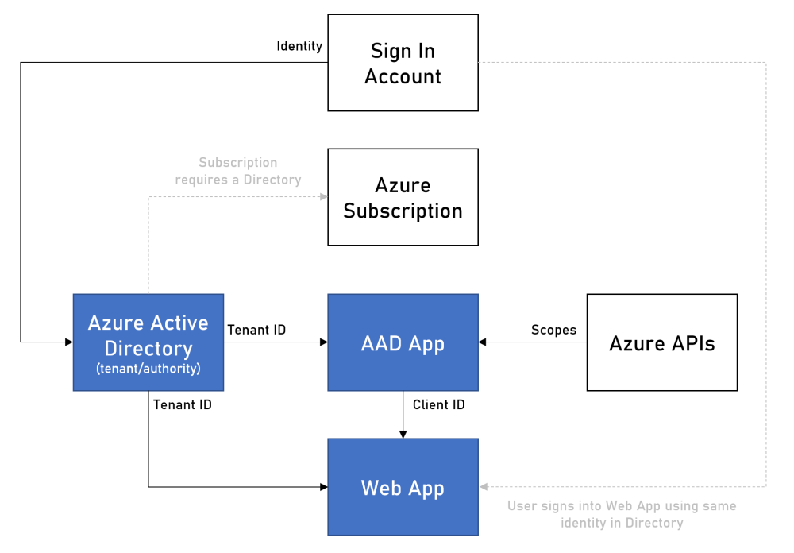

# Setting up an AAD application to work with IoT Central

An Azure Active Directory Application is an Azure resource that deploys as part of your ecosystem and enables users with an identity to authenticate and be authorized to Azure services/resources/APIs.

__Why would you need one?__ If there is a need to build a custom user experience as a compliment to the IoT Central user experience, e.g., a fit for purpose app for a specific type of role/usage. Alternatively, you might want to embed IoT Central functionality directly into your existing application.

- To learn more about application management in Azure please visit the Azure docs site [here](https://docs.microsoft.com/en-us/azure/active-directory/manage-apps/what-is-application-management).

- The [Microsoft identity platform](https://docs.microsoft.com/en-us/azure/active-directory/develop/v2-overview) helps you build applications your users and customers can sign in to using their Microsoft identities or social accounts, and provide authorized access to your own APIs or Microsoft APIs like Microsoft Graph.

- To learn more about the Azure IoT Central REST APIs visit the Azure docs site [here](https://docs.microsoft.com/en-us/rest/api/iotcentral)

## __Prerequisites__

To complete the instructions in this guide you must have an Azure account with a Subscription and permissions to add services to that account. Click [here](https://azure.microsoft.com/en-us/free) to learn more about Azure Subscriptions.

### __Services to add to your Subscription__
You will be adding two to three services.
- An Azure Active Directory: This is the service that stores user membership and allows authentication. *
- An Azure Active Directory application: This is the service that brokers the authentication/authorization of a user to a set of resources.
- An Azure Web Apps service: A fit for purpose application that requires a user sign-in.  User and credentials, i.e., identity username, password, and profile, are managed by the OAUTH provider and fall outside the scope of this guide. However, for the purposes of this guide Microsoft Account will be the OAUTH provider and therefore you should have an MSA.

\* When you initially set up your Azure account, you will have a Directory created for you. You can use this directory or create a new one.

### __Topology__
The following diagram outlines how all the services and supporting concepts are related.

The sign-in account represents the identity used to create the Azure account, Subscription and Directory.

- An Azure account is the main account to manage all your Azure resources. An Azure account can have many Azure Active Directories.
- An Azure Active Directory can have many Subscriptions but can only belong to one Azure account.
- An Azure Subscription is a logical container that is used to hold the details of any resources that are created/deployed as part of your Azure account. An Azure Subscription can only belong to one Azure Active Directory.

## __Setting up an Azure Active Directory using the Azure Portal__

Creating a Directory is a lightweight exercise. Therefore, if you make a mistake delete and start again.

See also "Quickstart : [Setup a tenant](https://docs.microsoft.com/en-us/azure/active-directory/develop/quickstart-create-new-tenant)"

1. Visit [Azure Portal](https://portal.azure.com) and sign-in using the admin account.

   

2. Using the global search type in ‘Azure Active Directory’ and click on result returned.

3. Review the current directory setup. In most scenarios using the Directory created with the account is recommended. However, if you have existing AAD Applications configured to use the default directory then creating a new one is recommended as test users can be added without affecting the default Directory.

   If you are creating a new, select “Create a tenant” from the Overview section and follow the instructions in the create wizard. Ensure you select the tenant type as “Azure Active Directory”. The rest of the information required is your choice.

   

## __Setting up the Azure Active Directory application__
Creating an Application is a lightweight exercise. Therefore, if you make a mistake delete and start again.

- See also "Quickstart : [Register an application](https://docs.microsoft.com/en-us/azure/active-directory/develop/quickstart-register-app)"

1.	Visit [Azure Portal](https://portal.azure.com) and sign-in using the user account.

2.	Using the global search type in ‘Azure Active Directory’ and click on result returned.

3.	If you are not in the correct Directory/Tenant use the “Switch Tenant” option and select the correct Directory. This will ensure you are using the correct Directory+Subscription combination.

4.	From the left menu, select “App registrations” and “New registration” from the content area menu bar.

5.	Complete the highlighted section in the form in the following way. Select your own desired name (this is never a reference).

    

6.	Register the application and on success you will be presented with an Overview of the application. Ensure the Tenant ID matches that of the logged in user’s Directory+Subscription.

    

    From the Overview, there are two options that will be needed to be configured.

7. From the left menu, select “Authentication” and then use the “Add a platform” option. This will setup the application type.

8. From the returned options, pick “Single-page application”

    

9. From the selected result, configure the Redirect URI. This is the location AAD will return to after the user has authenticated. When configuring the client code to use this app, this will need to be matching. During the dev cycle this should be set up to return to the dev environment (port is not required and can be configured in the code). However, when deploying to production, this should be the final production Url. Please review the inline help to learn more about Redirect URI(s).

    

10. Once returned, select “API permissions” from the left menu. This allows you to add references to Azure’s set of API - Public, Org, Custom. Each API / Permission combination is known as a Scope. API providers will provide multiple Scopes. It is up to the API provider to decide how to implement each Scope within their services. Therefore, it is essential to understand the Scopes you are consuming. Microsoft Graph has an excellent Scope implementation and worth reviewing to understand more about how scopes are utilized.

- See also "Quickstart : [Configure an application to expose a web API](https://docs.microsoft.com/en-us/azure/active-directory/develop/quickstart-configure-app-expose-web-apis)"
- See also "Quickstart : [Configure a client application to access a web API](https://docs.microsoft.com/en-us/azure/active-directory/develop/quickstart-configure-app-access-web-apis)"

  By default, when creating an application, the Microsoft Graph Scope is added to your application. This allows the application to get profile information about the logged in user and is generally a requirement for most apps. Therefore, it is not recommended to remove this Scope. If you do, it can be added back later.

    

11. Select the “Add a permission” option and then “APIs my organization uses”.  To find it using the search box, enter “Microsoft IoT Central”

    

    Configure the Scope you wish to have access to. For IoT Central, the “user_impersonation” Scope is the only one required. You will be using “Delegated permissions”

    

    Complete the form. This is the final step.

    

__Congratulations!__ You have now configurated an AAD application to use Azure IoT Central REST APIs.

---

## __Testing the AAD application setup__

To test that this has been configured correctly, visit [this repo](https://github.com/iot-for-all/iot-central-aad-app)  and follow the setup and install instructions. You will need to  use your Tenant/Directory ID and Application/Client ID from the created AAD application. The codebase is an interactive walkthrough that demonstrates the API calls and payloads returned and can be refactored in the base of your own application.

